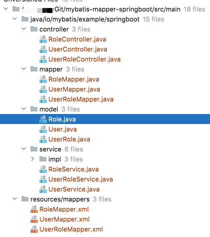

# mybatis-mapper spring-boot 示例

## https://mapper.mybatis.io

## 项目依赖

当前项目依赖中，主要包含了:
```xml
<dependency>
  <groupId>io.mybatis</groupId>
  <artifactId>mybatis-service</artifactId>
  <version>1.0.2</version>
</dependency>
```
这个依赖会传递依赖 `mybatis-mapper` 模块。

除此之外还有 mybatis 的 starter:
```xml
<dependency>
  <groupId>org.mybatis.spring.boot</groupId>
  <artifactId>mybatis-spring-boot-starter</artifactId>
  <version>2.2.0</version>
</dependency>
```

项目使用的 MySQL 数据库:
```xml
<dependency>
  <groupId>mysql</groupId>
  <artifactId>mysql-connector-java</artifactId>
  <scope>runtime</scope>
</dependency>
```

## 基础代码

项目中只有 `MapperSpringbootApplication` 类和对应的测试代码类：
```java
import org.springframework.boot.SpringApplication;
import org.springframework.boot.autoconfigure.SpringBootApplication;

@SpringBootApplication
public class MapperSpringbootApplication {

  public static void main(String[] args) {
    SpringApplication.run(MapperSpringbootApplication.class, args);
  }

}
```
没有特殊的东西。

除了俩代码，剩下的还有一个 spring-boot 配置文件:
```yaml
spring:
  datasource:
    url: jdbc:mysql://localhost:3306/test?useSSL=false
    username: root
    password:
mybatis:
  mapper-locations: classpath*:mappers/*.xml
```

这个配置文件根据自己的需要进行配置即可。

## 代码生成器

只有上面一个启动类的情况下，这个项目没什么可用的内容，所有代码都可以通过代码生成器自动生成。

代码生成器在 `generator` 目录中：

- lib: jar包目录，代码生成器所有依赖的 jar 都可以放到该目录
  - mysql-connector-java-5.1.49.jar: 当前项目使用的 MySQL 驱动，如果连接其他数据库，可以使用其他驱动
  - rui-cli.jar: 代码生成器
- mapper-templates: 代码模板
- project.yaml: 代码生成器配置文件
- run.bat: windows执行脚本
- run.sh: linux,mac执行脚本

>代码生成器完整文档看这里: https://mapper.mybatis.io/docs/7.generator.html

当前代码生成器已经配置好，需要修改的地方是数据库连接信息和需要生成代码的表，对应下面配置：
```yaml
database:
  # 数据库连接配置
  jdbcConnection:
    # 使用方言，默认为 JDBC 方式，可能会取不到表或字段注释
    # 后续介绍如何通过字典匹配注释值
    dialect: MYSQL
    # jdbc驱动
    driver: com.mysql.jdbc.Driver
    # jdbc连接地址
    url: jdbc:mysql://localhost:3306/test?useSSL=false
    # 用户名
    user: root
    # 密码
    password:
  # 获取表配置，支持 % 和 _ 模糊匹配，可以配置多个值
  # 还有一个支持复杂规则 tableRules 属性后续单独介绍
  tables:
    - '%'
```

`tables` 部分可以配置多个表名，支持模糊匹配（使用 `%` 和 `_`），上面配置的 `%` 会匹配当前数据库下面的所有表。你可以指定要生成的表：
```yaml
  tables:
    - 'user'
    - 'role'
    - 'user_role'
```

配置完成后，在控制台执行上面的 `run.xx` 脚本，脚本就一行命令 `java -cp "lib/*" io.mybatis.rui.cli.Main -p project.yaml`。

执行命令效果：
```
$ ./run.sh 
[main] TRACE Project - SYS可用参数:
[main] TRACE Project - SYS['sun.cpu.isalist'] = 

省略大量系统变量...

[main] TRACE Project - SYS['user.dir'] = /Users/test/Git/mybatis-mapper-springboot/generator
[main] TRACE Project - SYS['java.runtime.name'] = Java(TM) SE Runtime Environment

[main] TRACE Project - ENV可用参数:
[main] TRACE Project - ENV['SHELL'] = /bin/bash
[main] TRACE Project - ENV['JAVA_MAIN_CLASS_13215'] = io.mybatis.rui.cli.Main
[main] TRACE Project - ENV['JAVA_HOME'] = /Library/Java/JavaVirtualMachines/jdk1.8.0_202.jdk/Contents/Home/

省略大量环境变量...

in] DEBUG Project - 执行程序路径: /Users/xhj/Git/mybatis-mapper-springboot/generator
[main] DEBUG Project - basedir变量: /Users/xhj/Git/mybatis-mapper-springboot/generator
[main] DEBUG Project - yamlDir变量: /Users/xhj/Git/mybatis-mapper-springboot/generator
[main] DEBUG Database - 获取数据库信息
[2021-10-27 11:16:24] [DEBUG] rui.pJ: Use [Hutool Console Logging] Logger As Default.
[main] DEBUG Database - 获取表: role
[main] TRACE Database - 记录列: id
[main] TRACE Database - 记录列: role_name
[main] DEBUG Database - 获取表: user
[main] TRACE Database - 记录列: id
[main] TRACE Database - 记录列: user_name
[main] TRACE Database - 记录列: user_age
[main] TRACE Database - 记录列: address
[main] DEBUG Database - 获取表: user_role
[main] TRACE Database - 记录列: id
[main] TRACE Database - 记录列: user_id
[main] TRACE Database - 记录列: role_id
[main] DEBUG Database - 通过 SQL 获取表的注释信息
[main] DEBUG Database - 执行 SQL: SELECT TABLE_NAME, TABLE_COMMENT 
                                 FROM information_schema.TABLES 
                                 WHERE TABLE_SCHEMA = 'test' 
                                       AND TABLE_NAME in ( 'user_role','role','user' )
[main] DEBUG Database - 表: role - 角色
[main] DEBUG Database - 表: user - 用户
[main] DEBUG Database - 表: user_role - 用户和角色关联
[main] DEBUG Context - 生成项目路径: /Users/test/Git/mybatis-mapper-springboot/generator/../../
[main] DEBUG Context - 读取模板路径: mapper-templates
[main] DEBUG Generator - 已存在目录: /Users/test/Git/mybatis-mapper-springboot
[main] DEBUG Generator - 已存在目录: /Users/test/Git/mybatis-mapper-springboot/src/main
[main] DEBUG Generator - 已存在目录: /Users/test/Git/mybatis-mapper-springboot/src/main/java
[main] DEBUG Generator - 已存在包: io.mybatis.example.springboot
[main] DEBUG Generator - 创建包: mapper
[main] DEBUG Generator - 初次创建文件: RoleMapper.java
[main] DEBUG Generator - 初次创建文件: UserMapper.java
[main] DEBUG Generator - 初次创建文件: UserRoleMapper.java
[main] DEBUG Generator - 创建包: model
[main] DEBUG Generator - 初次创建文件: Role.java
[main] DEBUG Generator - 初次创建文件: User.java
[main] DEBUG Generator - 初次创建文件: UserRole.java
[main] DEBUG Generator - 创建包: service
[main] DEBUG Generator - 初次创建文件: RoleService.java
[main] DEBUG Generator - 初次创建文件: UserService.java
[main] DEBUG Generator - 初次创建文件: UserRoleService.java
[main] DEBUG Generator - 创建包: impl
[main] DEBUG Generator - 初次创建文件: RoleServiceImpl.java
[main] DEBUG Generator - 初次创建文件: UserServiceImpl.java
[main] DEBUG Generator - 初次创建文件: UserRoleServiceImpl.java
[main] DEBUG Generator - 创建包: controller
[main] DEBUG Generator - 初次创建文件: RoleController.java
[main] DEBUG Generator - 初次创建文件: UserController.java
[main] DEBUG Generator - 初次创建文件: UserRoleController.java
[main] DEBUG Generator - 已存在目录: /Users/test/Git/mybatis-mapper-springboot/src/main/resources
[main] DEBUG Generator - 创建目录: /Users/test/Git/mybatis-mapper-springboot/src/main/resources/mappers
[main] DEBUG Generator - 初次创建文件: RoleMapper.xml
[main] DEBUG Generator - 初次创建文件: UserMapper.xml
[main] DEBUG Generator - 初次创建文件: UserRoleMapper.xml
```

生成代码如下：



## 运行项目

生成代码后，启动服务，可以通过HTTP简单测试。

```
GET http://127.0.0.1:8080/roles

HTTP/1.1 200 
Content-Type: application/json
Transfer-Encoding: chunked
Date: Wed, 27 Oct 2021 03:36:05 GMT
Keep-Alive: timeout=60
Connection: keep-alive

[
  {
    "id": 1,
    "roleName": "管理员"
  }
]
```

## 必要的代码

可以根据生成的代码简单了解 mybatis-mapper，使用 mybatis-mapper 只需要两个主要的类，其他都是可选的辅助，主要的两个类，
一个是实体类，例如：

```java
@Entity.Table(value = "user", remark = "用户", autoResultMap = true)
public class User {
  @Entity.Column(value = "id", id = true, remark = "主键", updatable = false, insertable = false)
  private Long id;

  @Entity.Column(value = "user_name", remark = "用户名")
  private String userName;

  @Entity.Column(value = "user_age", remark = "年龄")
  private Integer userAge;

  @Entity.Column(value = "address", remark = "地址")
  private String address;

  //省略 getter,setter
}
```

还有一个 Mapper 接口:
```java
import io.mybatis.mapper.Mapper;
import io.mybatis.example.springboot.model.User;

/**
 * user - 用户
 *
 * @author xhj
 */
@org.apache.ibatis.annotations.Mapper
public interface UserMapper extends Mapper<User, Long> {

}
```

由于通用 Mapper 接口和 `@org.apache.ibatis.annotations.Mapper` 同名，所以注解带上的包名，当使用注解标记接口时，
MyBatis 不需要 `@MapperScan` 注解即可使用。